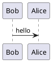

# Remark Refer PlantUML

[](https://www.npmjs.com/package/remark-refer-plantuml)
[](./LICENSE)
[](https://bundlephobia.com/package/remark-refer-plantuml)
[](https://unifiedjs.com)

A Unified/Remark plugin to automatically refer PlantUML diagrams into embeddable image URLs. Transform UML code blocks into visual diagrams.

## Installation

```bash
npm install remark-refer-plantuml
```

## Usage

**Input Markdown**:

````markdown
## Hello World

This is the PlantUML diagram.


````

Use this plugin in your code,

```typescript
import {unified} from 'unified';
import remarkParse from 'remark-parse';
import remarkStringify from 'remark-stringify';
import remarkReferPlantUml from 'remark-refer-plantuml';

const processor = unified().use(remarkParse).use(remarkReferPlantUml).use(remarkStringify);

const output = await processor.process(input);
```

It will output,

```markdown
## Hello World

This is the PlantUML diagram.


```

## API

This package is **ESM-only** and provides a default export: `remarkReferPlantUml`. You can integrate it with `unified.js`, `react-markdown` and so on.

### `unified().use(remarkReferPlantUml, options?)`

### Options

#### `format?: 'png' | 'svg'`

Specifies the output format. Defaults to `'png'`. Only `'svg'` and `'png'` are supported.

#### `darkMode?: boolean`

Enables dark mode for diagrams. Default to `false`.

#### `url?: string`

The Plantuml server used to generate the diagram hyperlinks, you can use your deployed one. Default to the official server instance [https://www.plantuml.com/plantuml](https://www.plantuml.com/plantuml) if you are ok with sending data to it.

#### `silent?: boolean`

Ignore all warnings. Default to `false`.

## Contributing

We welcome contributions! Please read our [Contribution Guide](CONTRIBUTION.md) before submitting PRs.

## License

[MIT](./LICENSE) © [但为君故](https://github.com/PrinOrange)
